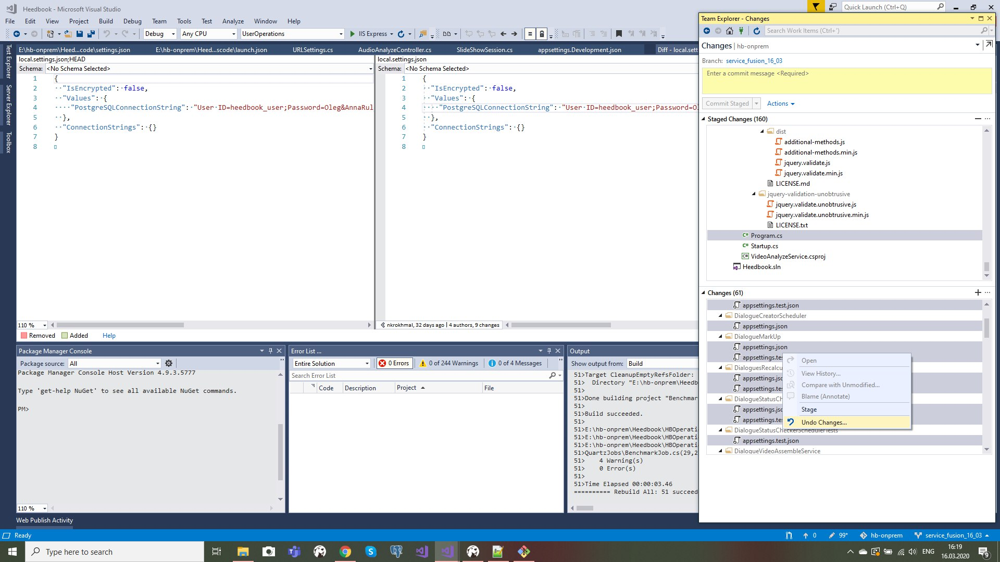
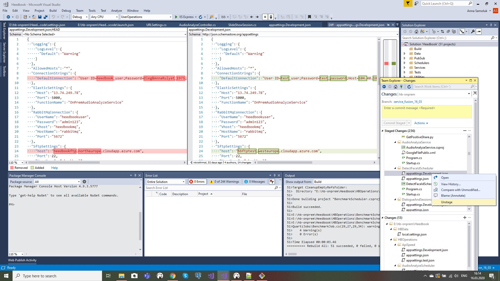

Merge master and another branch
============================================

1. Merge master into branch
^^^^^^^^^^^^^^^^^^^^^^^^^^^
   - branch name: **devices**
   - master name: **master**

.. code:: bash
	
	git checkout master
	git pull
	git checkout devices
	git fetch origin
	git merge origin/master	

-----------------------------

	- in case you have conflicts
	
	 Open your favorite text editor, such as VS or VS code, and choose "take source" option on git panel.

    	- check appsetting files, and replase all settings, if needed

	- commit your stages

.. code:: bash

        git add .
	git commit -m "merge"
	git push

----------------------------

2. Merge branch into master
^^^^^^^^^^^^^^^^^^^^^^^^^^^

	- create new branch from master

.. code:: bash

	git checkout master
	git pull
	git checkout -b fusion_branch
	

----------------------------

	 2.1. case 1:
		
.. code:: bash

	git merge --no-commit devices
	git status
	git add <file names for adding to commit>
	git commit -m <commit name>
	git push --set-upstream origin fusion_branch

---------------------------	
	
	 - create pull request to merge fusion_branch into master

---------------------------

	 2.1. case 2:

	 - add to commit particular folders/files
	
.. code:: bash

	git checkout origin/devices --Heedbook/HbApi
	git checkout origin/devices --Heedbook/HbOperations

----------------------------

	open project in IDE (VS, VS Code)
	remove settings from commit

----------------------------

	make pull request to merge your stages into master from fusion_branch

		
